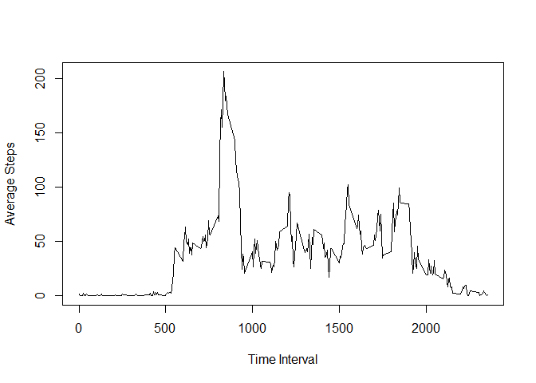

## Loading and preprocessing the data

Load data and packages to be used in anaylsis. 'activity.csv' must be in working directory.


```r
library(lubridate)
```

```
## 
## Attaching package: 'lubridate'
```

```
## The following objects are masked from 'package:base':
## 
##     date, intersect, setdiff, union
```

```r
library(dplyr)
```

```
## 
## Attaching package: 'dplyr'
```

```
## The following objects are masked from 'package:lubridate':
## 
##     intersect, setdiff, union
```

```
## The following objects are masked from 'package:stats':
## 
##     filter, lag
```

```
## The following objects are masked from 'package:base':
## 
##     intersect, setdiff, setequal, union
```

```r
library(ggplot2)

raw <- read.csv("activity.csv")
```

## What is mean total number of steps taken per day?

Make a histogram of the total number of steps taken each day.


```r
sum_summary <- raw %>%
        group_by(date) %>%
        summarize(totalsteps = sum(steps, na.rm = T))

hist(sum_summary$totalsteps, main = "Total Daily Steps", xlab = "Steps per Day")
```

<!-- -->

Calculate and report the **mean** and **median** total number of steps taken per day


```r
mean_steps <- mean(sum_summary$totalsteps)
median_steps <- median(sum_summary$totalsteps)
```

The mean total number of steps taken per day is 9354.2295082.

The median total number of steps taken per day is 10395.

## What is the average daily activity pattern?

Make a time series plot (i.e. `type = "l"`) of the 5-minute interval (x-axis) and the average number of steps taken, averaged across all days (y-axis).


```r
interval_summary <- raw %>%
        group_by(interval) %>%
        summarize(avgsteps = mean(steps, na.rm = T))

plot(x = interval_summary$interval, y = interval_summary$avgsteps, type = "l", xlab = "Time Interval", ylab = "Average Steps")
```

<!-- -->

Which 5-minute interval, on average across all the days in the dataset, contains the maximum number of steps?


```r
interval_max <- filter(interval_summary, avgsteps == max(interval_summary$avgsteps))
```

The five minute interval, averaged across all the days in the dataset, that contains the maximum number of steps is 835.

## Imputing missing values

Calculate and report the total number of missing values in the dataset (i.e. the total number of rows with `NA`s).


```r
NAs <- is.na(raw$steps)
total_NAs <- sum(NAs)
```

Total NAs: 2304

# Strategy for Imputing Data

My strategy for imputing data was to substitute the mean of the corresponding 5 minute interval for NAs.

Create a new dataset that is equal to the original dataset but with the missing data filled in.


```r
index <- which(NAs)
steps_impute <- raw 
steps_impute$steps[index] <- interval_summary$avgsteps[(index -1) %% length(interval_summary$avgsteps) + 1]
```

Make a histogram of the total number of steps taken each day and Calculate and report the **mean** and **median** total number of steps taken per day. Do these values differ from the estimates from the first part of the assignment? What is the impact of imputing missing data on the estimates of the total daily number of steps?


```r
impute_sum <- steps_impute %>%
        group_by(date) %>%
        summarize(totalsteps = sum(steps, na.rm = T))

hist(impute_sum$totalsteps, main = "Total Daily Steps (Imputed)", xlab = "Steps per Day")
```

<!-- -->


```r
impute_mean <- mean(impute_sum$totalsteps)
impute_median <- median(impute_sum$totalsteps)
```

The mean and median total number of steps taken per day increased when data was imputed for missing values. Simply removing the NAs, as was done in the initial analysis, introduced 0s, which skewed the data low. Imputing data corrected for that.

The mean total number of steps taken per day with data imputed is 1.0766189\times 10^{4}.

The median total number of steps taken per day with data imputed is 1.0766189\times 10^{4}.

## Are there differences in activity patterns between weekdays and weekends?

Create a new factor variable in the dataset with two levels -- "weekday" and "weekend" indicating whether a given date is a weekday or weekend day.


```r
steps_impute$date <- ymd(steps_impute$date)     #Convert variable 'date' to class Date
steps_impute <- mutate(steps_impute, dayclass = wday(steps_impute$date) == 6 | wday(steps_impute$date) == 7)
        
steps_impute$dayclass <- gsub("TRUE", "weekend", steps_impute$dayclass)
steps_impute$dayclass <- gsub("FALSE", "weekday", steps_impute$dayclass)
steps_impute$dayclass <- factor(steps_impute$dayclass, levels = c("weekday","weekend"))
```

Make a panel plot containing a time series plot (i.e. `type = "l"`) of the 5-minute interval (x-axis) and the average number of steps taken, averaged across all weekday days or weekend days (y-axis).


```r
dayclass_interval_summary <- steps_impute %>%
        group_by(dayclass, interval) %>%
        summarize(avesteps = mean(steps))

p <- ggplot(dayclass_interval_summary, aes(x = interval, y = avesteps)) + geom_line()
p + facet_grid(rows = vars(dayclass)) + labs(y = "Number of Steps")
```

<!-- -->
